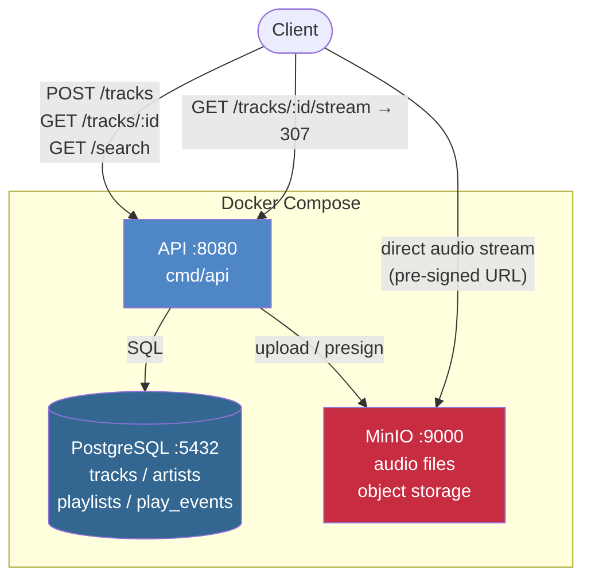

# Phase 0 — Local Monolith

## Architecture



## What we built

A minimal Spotify-like API running as a single process with Postgres, MinIO (S3-compatible), and Redis — all in Docker Compose.

Endpoints: `POST /artists`, `GET /artists/:id`, `POST /tracks`, `GET /tracks/:id`, `GET /tracks/:id/stream`, playlist CRUD, `GET /search`.

---

## Key concepts

### Pre-signed URLs for audio streaming

The stream endpoint does **not** proxy the audio file through the API server. Instead:

1. Client calls `GET /tracks/:id/stream`
2. API looks up the `audio_key` in Postgres
3. API calls MinIO to generate a pre-signed URL (valid 1 hour)
4. API returns `307 Temporary Redirect` to the pre-signed URL
5. Client fetches audio **directly from MinIO/S3**

**Why:** If the API proxied audio, a single 5MB file × 1000 concurrent listeners = 5GB/s of bandwidth through the API server. Pre-signed URLs offload that entirely to object storage.

### Play events as a separate table

`play_events` is its own table, not just a counter on `tracks`.

```sql
CREATE TABLE play_events (
  id         UUID DEFAULT gen_random_uuid() PRIMARY KEY,
  track_id   UUID REFERENCES tracks(id),
  played_at  TIMESTAMPTZ DEFAULT now(),
  source     TEXT
);
```

**Why:** A counter tells you total plays. A table tells you *when* people listened, *from where*, and lets you partition by time for analytics. You can answer "plays in the last 7 days" or "peak listening hour" — a counter can't.

The `play_count` on `tracks` is a denormalized cache of the count — fast to read, updated asynchronously (Phase 2 makes this proper).

### Full-text search with PostgreSQL tsvector

```sql
WHERE search_vector @@ plainto_tsquery('english', $1)
ORDER BY ts_rank(search_vector, plainto_tsquery('english', $1)) DESC
```

`search_vector` is a generated column updated automatically on insert/update. No external search service needed at this scale.

### Graceful shutdown

```go
signal.Notify(quit, syscall.SIGINT, syscall.SIGTERM)
<-quit
srv.Shutdown(ctx) // waits for in-flight requests to finish
```

Without this, killing the process mid-request drops responses. Docker and Kubernetes send SIGTERM before SIGKILL — you have a window to finish cleanly.

---

## MinIO — How Concurrent Streaming Works

This was set up in Phase 0, but the internals matter for any interview question about concurrency.

**Why MinIO can serve thousands of concurrent reads without multiplying memory:**

The OS loads the file into **page cache** (RAM) once. Every reader gets their own file descriptor tracking an independent offset — they all read from the same underlying pages.

```
file on disk → loaded into page cache (one copy in RAM)

fd_A: offset = 0        ─┐
fd_B: offset = 0        ─┤  → all read from the same page cache
fd_C: offset = 512000   ─┘
```

Reading is non-destructive: no locks needed for concurrent reads.

**Go goroutines (one per HTTP connection):**

- ~4KB stack each — not OS threads
- Go runtime multiplexes many goroutines onto a few OS threads
- When goroutine A waits for a network ACK, the runtime runs goroutine B — no thread is wasted waiting

**Why memory doesn't multiply per listener:**

Goroutines stream in small chunks (~64KB), not the whole file:

```
goroutine A:
  copy 64KB from page cache → send to socket → free buffer
  wait for ACK (Go runtime runs others here)
  copy next 64KB → ...
```

Memory breakdown for 1000 concurrent 5MB streams:
```
page cache:              5MB   (one copy, shared)
1000 × 64KB buffers:    64MB
1000 × 8KB goroutines:   8MB
──────────────────────────────
total: ~77MB    (not 1000 × 5MB = 5GB)
```

Real bottleneck ordering: **network bandwidth first** (1Gbps ≈ 25 simultaneous 5MB streams), then RAM, then OS file descriptor limit (65536/process, configurable).

---

## Gotchas discovered

- MinIO pre-signed URLs use the **internal** Docker hostname (`minio:9000`) by default. If the client is outside Docker, it gets a URL it can't reach. Need to configure the external URL for production.
- `play_count` increment is fire-and-forget in a goroutine — this is intentionally non-critical in Phase 0 but will be replaced by Kafka in Phase 2.

---

## Interview talking points

**"Walk me through your database schema."**
> tracks references artists, play_events references tracks. I separated play events from the counter on tracks because a separate table lets me query time-series data — total plays, plays per day, peak hour. The counter on tracks is a denormalized read cache.

**"How does pre-signed URL streaming work? Why not proxy through your API?"**
> The API generates a time-limited URL signed with the object storage credentials and redirects the client there. The client streams directly from S3/MinIO. Proxying would funnel all audio bandwidth through the API — at any real scale that's the first thing to saturate.

**"How does MinIO handle thousands of concurrent listeners without running out of memory?"**
> The OS loads the file into page cache once. Each connection gets its own file descriptor tracking an independent offset — all reading from the same RAM pages. Go goroutines stream in 64KB chunks rather than loading the entire file, so 1000 concurrent listeners of a 5MB track use ~77MB, not 5GB.

---

## Demo

**Prerequisites:**
```bash
cd beatstream
make up        # start all services
make migrate   # run migrations
make seed      # load sample data (Radiohead, Portishead, etc.)
```

---

### 1. List tracks — observe seed data

```bash
curl -s http://localhost:80/v1/tracks | python3 -m json.tool | head -30
```

**Expected output:**
```json
{
  "items": [
    { "id": "aaaa0001-...", "title": "Creep", "status": "ready", "play_count": 982342 },
    { "id": "aaaa0002-...", "title": "Karma Police", ... }
  ],
  "total": 32
}
```

**What this demonstrates:** The API → Postgres read path is working. `play_count` is a denormalized field (fast reads); Phase 2 will contrast this with the async-update version.

---

### 2. Audio streaming — observe 307 redirect, not a direct audio response

```bash
curl -v http://localhost/v1/tracks/aaaa0001-0000-0000-0000-000000000000/stream 2>&1 | grep -E "< HTTP|Location:"
```

**Expected output:**
```
< HTTP/1.1 307 Temporary Redirect
< Location: http://localhost:9000/beatstream-audio/tracks/.../audio?X-Amz-Signature=...
```

**What this demonstrates:** The API does not proxy audio data. It only: ① looks up `audio_key` in the DB ② asks MinIO to sign a URL ③ returns a 307 redirect. The browser's `<audio>` element fetches audio directly from MinIO — no audio bytes flow through the API.

---

### 3. Full-text search — observe Postgres tsvector query results

```bash
curl -s "http://localhost/v1/search?q=karma" | python3 -m json.tool
```

**Expected output:**
```json
{ "items": [{ "title": "Karma Police", ... }], "total": 2 }
```

**What this demonstrates:** No Elasticsearch needed. The Postgres `search_vector TSVECTOR GENERATED ALWAYS AS (...)` column is a computed column, maintained automatically on insert/update. `@@` with a GIN index means full-text search uses an index scan, not a full table scan.

---

### 4. Create artist + track — observe data written to Postgres

```bash
# Create artist
ARTIST=$(curl -s -X POST http://localhost/v1/artists \
  -H "Content-Type: application/json" \
  -d '{"name":"My Band"}')
echo $ARTIST

ARTIST_ID=$(echo $ARTIST | python3 -c "import sys,json; print(json.load(sys.stdin)['id'])")

# Upload track (requires an audio file)
dd if=/dev/urandom bs=1024 count=100 > /tmp/demo.mp3
curl -s -X POST http://localhost/v1/tracks \
  -F "title=Demo Song" \
  -F "artist_id=$ARTIST_ID" \
  -F "duration_ms=180000" \
  -F "audio=@/tmp/demo.mp3;type=audio/mpeg" | python3 -m json.tool
```

**Expected output:** `"status": "pending"` — the audio has been uploaded to MinIO and the DB record created, but the worker has not yet processed it (the worker is added in Phase 2).

---

### 5. MinIO console — confirm the audio file exists

Open http://localhost:9001 (credentials: minioadmin / minioadmin)

**Expected output:** A `tracks/<uuid>/audio` object inside the `beatstream-audio` bucket.

**What this demonstrates:** The API PUTs the binary directly to MinIO (S3-compatible object storage) rather than writing to local disk — the correct cloud-native storage approach.
