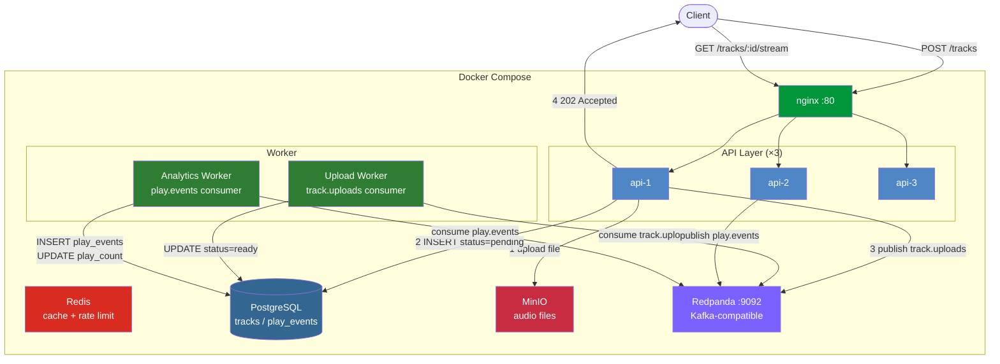

# Phase 2 — Async & Queues

## Architecture



## Goal

Decouple two latency-sensitive paths from the synchronous request cycle:

1. **Upload processing** — transcoding audio is CPU-heavy and can take seconds; the HTTP response should not block on it.
2. **Play event recording** — at high throughput, writing every play directly to Postgres creates a write hotspot on the `tracks` table.

Redpanda (Kafka-compatible, single-binary, no ZooKeeper) is added as the message broker.

---

## What changed

### New services

| Service | Image | Role |
|---|---|---|
| `redpanda` | redpandadata/redpanda | Kafka-compatible broker, topics auto-created |
| `worker` | beatstream (target: worker) | Runs upload + analytics consumers |

### Topics

| Topic | Producer | Consumer group | Semantics |
|---|---|---|---|
| `track.uploads` | `POST /tracks` | `upload-workers` | at-least-once |
| `play.events` | `GET /tracks/:id/stream` | `analytics-workers` | at-least-once |

### Files added

```
beatstream/
├── internal/queue/kafka.go          # Producer + Consumer wrappers (franz-go)
├── internal/worker/upload.go        # Transcoding worker: pending → processing → ready
├── internal/worker/analytics.go     # Analytics worker: insert play_events + increment play_count
├── cmd/worker/main.go               # Worker binary entrypoint (runs both workers)
└── db/migrations/004_add_track_status.sql
```

### Files modified

```
├── internal/db/postgres.go          # + migration 004 (status column)
├── internal/handler/tracks.go       # POST /tracks → 202, publishes to track.uploads
│                                    # GET /tracks/:id/stream → publishes to play.events
├── cmd/api/main.go                  # + Kafka producer init
├── docker-compose.yml               # + redpanda, + worker service
├── Dockerfile                       # multi-target build (api, worker)
└── Makefile                         # + run-worker target
```

---

## Upload flow (before vs after)

**Before (Phase 1)**
```
POST /tracks
  → upload to MinIO (sync)
  → INSERT tracks (sync)
  → 201 Created (track ready immediately)
```

**After (Phase 2)**
```
POST /tracks
  → upload to MinIO (sync)           ← file must exist before worker runs
  → INSERT tracks status='pending'
  → publish to track.uploads
  → 202 Accepted {id, status: "pending"}

[upload worker]
  ← consume track.uploads
  → UPDATE status='processing'       ← optimistic lock prevents double-processing
  → sleep 2s (simulate ffmpeg)
  → UPDATE status='ready', duration_ms=N
```

Clients poll `GET /tracks/:id` until `status == "ready"`.

---

## At-least-once delivery and idempotency

franz-go with `kgo.AutoCommitMarks()` only commits offsets for records explicitly marked via `MarkCommitRecords`. If the worker crashes after processing but before marking, the record is redelivered.

**Upload worker idempotency guard:**
```go
// Check status before processing
if status != "pending" {
    return nil // already processed — safe to skip
}
// CAS-style update: only transitions from pending
UPDATE tracks SET status = 'processing' WHERE id = $1 AND status = 'pending'
```

This means even if the event is delivered twice, the second delivery is a no-op.

**Analytics worker:** duplicates result in a slightly over-counted `play_count`. Acceptable for analytics. For billing accuracy you would need event deduplication (e.g., include a UUID in the Kafka message and check a `processed_events` table).

---

## Why 202 instead of 200/201?

| Code | Meaning | When to use |
|---|---|---|
| `200 OK` | request fully satisfied | synchronous read |
| `201 Created` | resource created now | synchronous write |
| `202 Accepted` | queued for processing | async work |

Returning 201 would imply the track is ready to stream — but `duration_ms` is 0 and the audio hasn't been transcoded yet. 202 + status field makes the async contract explicit.

---

## Why Redpanda over Kafka?

| | Kafka | Redpanda |
|---|---|---|
| Dependencies | JVM + ZooKeeper (or KRaft) | Single Go binary |
| Local dev setup | Complex | `docker run` |
| Kafka protocol compatible | Yes (it's Kafka) | Yes |
| Production use | Yes | Yes |

For local dev and interviews: Redpanda dramatically reduces setup friction.

---

## Interview questions

**Q: Why use async processing for audio uploads? When do you return 202 vs 200?**

Audio transcoding is CPU/time-intensive (seconds to minutes). Blocking the HTTP connection while transcoding wastes server resources and degrades perceived performance. You return 202 when the work is *accepted but not yet complete* — the client can poll for status. Return 200/201 only when the work is fully done synchronously.

**Q: A Kafka consumer crashes mid-processing and restarts. How do you avoid processing the same event twice?**

Two parts: (1) delivery guarantee and (2) idempotent handler.

Franz-go's `AutoCommitMarks` gives at-least-once — records are redelivered after a crash. The handler is made idempotent: before processing, check if the track is still `pending`; use a conditional `UPDATE ... WHERE status = 'pending'` so only one consumer can claim the work. A second attempt sees `processing` or `ready` and skips.

For analytics (play events), duplicates are tolerable. For financial/critical data, include a UUID in the event payload and insert into a `processed_events` deduplication table inside the same DB transaction.

**Q: What's the problem with publishing to Kafka after the DB insert in the same HTTP handler?**

Split-brain risk: the DB write succeeds but the Kafka publish fails — the track is stuck `pending` forever. The correct fix is the **transactional outbox pattern**: write the event to an `outbox` table in the same DB transaction as the track insert, then have a separate relay process poll the outbox and publish to Kafka. This makes the DB the single source of truth and the publish eventually consistent but reliable.

---

## Demo

**Prerequisites:** `make up && make migrate && make seed` (includes Redpanda)

---

### 1. Upload a track — observe 202 Accepted + status=pending (async)

```bash
# Prepare a dummy mp3
dd if=/dev/urandom bs=1024 count=50 > /tmp/demo.mp3

# JWT token is required in Phase 5; in Phase 2 this endpoint is public
curl -s -X POST https://localhost/v1/tracks \
  -F "title=Async Demo" \
  -F "artist_id=11111111-1111-1111-1111-111111111111" \
  -F "duration_ms=180000" \
  -F "audio=@/tmp/demo.mp3;type=audio/mpeg" | python3 -m json.tool
```

**Expected output:**
```json
{
  "id": "xxxx-...",
  "title": "Async Demo",
  "status": "pending",   ← key point: not ready, but pending
  "duration_ms": 0       ← worker has not processed it yet; duration is still 0
}
```

**What this demonstrates:** The API returns 202 without waiting for transcoding to complete. The HTTP handler does: ① upload to MinIO ② INSERT status=pending ③ publish to Kafka `track.uploads` topic ④ return 202.

---

### 2. Wait for the worker — observe status transition from pending to ready

```bash
TRACK_ID="(id from above)"

# Query immediately: pending
curl -s https://localhost/v1/tracks/$TRACK_ID | python3 -c "import sys,json; print(json.load(sys.stdin)['status'])"

# Wait 2 seconds for the worker to consume and process the message
sleep 2

# Query again: should now be ready
curl -s https://localhost/v1/tracks/$TRACK_ID | python3 -m json.tool | grep -E "status|duration"
```

**Expected output:** `"status": "ready"` and a non-zero `"duration_ms"`.

**Confirm via worker logs:**
```bash
docker compose logs worker --tail 10
```

**Expected output:**
```
upload worker: transcoding track xxxx-...
upload worker: track xxxx-... ready (159909ms)
```

---

### 3. Redpanda topics — confirm both topics exist

```bash
docker exec beatstream-redpanda-1 rpk topic list
```

**Expected output:**
```
NAME           PARTITIONS  REPLICAS
play.events    1           1
track.uploads  1           1
```

**Trigger a play event and observe the analytics worker recording it:**
```bash
# Hit the stream endpoint to trigger a play event
curl -sk https://localhost/v1/tracks/aaaa0001-0000-0000-0000-000000000000/stream -o /dev/null

# Check that the worker consumed it
docker compose logs worker --tail 5
```

**Expected output:**
```
analytics worker: recorded play for track aaaa0001-...
```

---

### 4. Verify Kafka decoupling — stop the worker, uploads still succeed

```bash
# Stop the worker
docker compose stop worker

# Upload a track
curl -s -X POST https://localhost/v1/tracks \
  -F "title=No Worker Test" \
  -F "artist_id=11111111-1111-1111-1111-111111111111" \
  -F "audio=@/tmp/demo.mp3;type=audio/mpeg" | python3 -c "import sys,json; d=json.load(sys.stdin); print(d['id'], d['status'])"
```

**Expected output:** An id and `pending` are still returned — the API does not depend on the worker being alive; the message waits in Kafka.

```bash
# Restart the worker; it will consume the backlog
docker compose start worker
sleep 3
docker compose logs worker --tail 5
# Shows "track xxxx ready" — backlog processed
```

**What this demonstrates:** Kafka is a durable message log, not an in-memory queue. Messages are not lost when the worker crashes and restarts.
