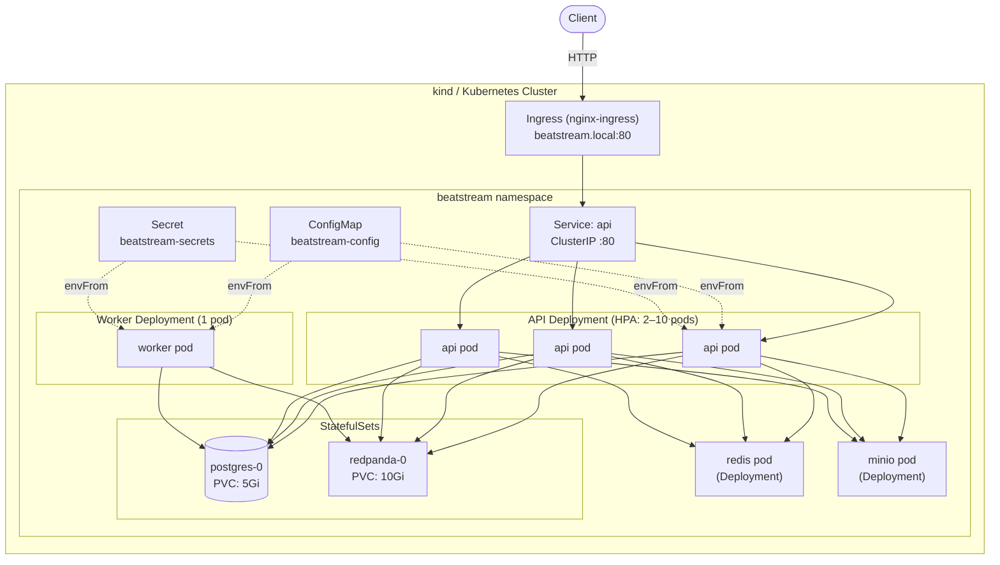

# Phase 3 — Kubernetes

## Architecture



## Goal

Replace Docker Compose with Kubernetes to gain:

1. **Automatic horizontal scaling** (HPA) — react to CPU spikes without manual intervention.
2. **Self-healing** — pods that crash or fail health checks are automatically restarted or replaced.
3. **Rolling zero-downtime deploys** — update the API without dropping requests.
4. **Declarative config separation** — credentials go into Secrets, not baked into YAML.

---

## Files added

```
beatstream/k8s/
├── namespace.yaml             # beatstream namespace
├── configmap.yaml             # non-sensitive env config
├── secret.yaml                # credentials (DB, MinIO, Redis)
├── api-deployment.yaml        # Deployment: 3 replicas, rolling update, probes, preStop
├── api-service.yaml           # ClusterIP Service
├── api-hpa.yaml               # HPA: 2–10 pods, CPU 60%, memory 70%
├── worker-deployment.yaml     # Deployment: 1 replica, Recreate strategy
├── postgres-statefulset.yaml  # StatefulSet + volumeClaimTemplate 5Gi
├── postgres-service.yaml      # Headless service (stable pod DNS)
├── redis-deployment.yaml      # Deployment + ClusterIP service
├── redpanda-statefulset.yaml  # StatefulSet + volumeClaimTemplate 10Gi + headless service
├── minio-deployment.yaml      # Deployment + ClusterIP service
└── ingress.yaml               # Ingress (nginx): routes /v1/, /healthz, /ready
```

---

## Kubernetes Architecture

K8s is split into two layers: the **Control Plane** (brain) and **Worker Nodes** (hands).

```
┌─────────────────────────────────────────────────────────────┐
│                      Control Plane                          │
│                                                             │
│  ┌─────────────┐    ┌──────────┐    ┌───────────────────┐  │
│  │  API Server │◄──►│  etcd    │    │ Controller Manager │  │
│  │ (only entry)│    │(state DB)│    │  (dozens of loops) │  │
│  └──────┬──────┘    └──────────┘    └───────────────────┘  │
│         │                                                   │
│  ┌──────┴──────┐                                            │
│  │  Scheduler  │                                            │
│  │(picks node) │                                            │
│  └─────────────┘                                            │
└──────────────────────────┬──────────────────────────────────┘
                           │ (watches API Server)
          ┌────────────────┼────────────────┐
   ┌──────▼──────┐  ┌──────▼──────┐  ┌──────▼──────┐
   │  Worker 1   │  │  Worker 2   │  │  Worker 3   │
   │  kubelet    │  │  kubelet    │  │  kubelet    │
   │  kube-proxy │  │  kube-proxy │  │  kube-proxy │
   │  containerd │  │  containerd │  │  containerd │
   └─────────────┘  └─────────────┘  └─────────────┘
```

### etcd — the single source of truth

All K8s state lives in etcd: every YAML you applied, which node each pod is on, service endpoints, secret values.

```
/registry/pods/beatstream/api-xxx        →  {spec, status, ...}
/registry/deployments/beatstream/api     →  {replicas: 3, ...}
/registry/endpoints/beatstream/api       →  {10.244.0.23, 10.244.0.24, ...}
```

If etcd goes down, the control plane loses the ability to create, modify, or delete anything. Existing pods keep running (worker nodes don't depend on etcd), but no new work can be scheduled. Production etcd must have 3 or 5 nodes for quorum.

### API Server — the only entry point

Everything (kubectl, kubelet, controllers) talks to etcd exclusively through the API Server. It handles authentication, RBAC authorization, schema validation, and then writes to etcd.

Key feature: **watch**. Any component can say "notify me immediately when this resource changes." The entire reactivity of K8s is built on watches, not polling.

### Scheduler — does exactly one thing

When a Pod has no `nodeName`, the Scheduler picks one and writes it in. Two steps:

1. **Filter**: which nodes are eligible? (enough CPU/memory, taints match tolerations, affinity rules pass)
2. **Score**: which eligible node is best? (most free resources, fewest pods of the same type)

The Scheduler only writes `nodeName`. It does not start any container.

### Controller Manager — dozens of reconciliation loops

Every controller follows the same pattern:

```go
func reconcile() {
    desired := read declared state from API Server
    actual  := observe current state
    if desired != actual {
        create / update / delete K8s objects  // never directly runs containers
    }
}
```

**Complexity comes from composition, not from any single controller being complex:**

```
You declare: Deployment replicas=3
  → Deployment Controller creates a ReplicaSet object
  → ReplicaSet Controller creates 3 Pod objects (just data in etcd, no container yet)
  → Scheduler writes nodeName on each Pod
  → kubelet on that node tells containerd to pull image and run container
  → kubelet runs readinessProbe → writes pod.status.ready = true
  → Endpoint Controller adds the pod IP to the Service's Endpoints object
  → kube-proxy updates iptables rules on every node
```

Each layer is simple. The combination delivers complex behavior. This is Separation of Concerns.

### kubelet — the node-level agent

kubelet is a system daemon on every worker node, not a pod inside K8s. It is the bridge between the API Server world and real containers.

```
1. Watches API Server: "any pod with nodeName=me that I'm not running yet?"
2. Calls containerd (via CRI) to pull image, create container, mount volumes
3. Runs liveness and readiness probes on a schedule:
   - liveness fails  → kill + restart the container
   - readiness fails → set pod status to not-ready
                       → Endpoint Controller removes pod from Service
4. Writes pod status back to API Server
```

### kube-proxy — the iptables rules manager

Despite the name, kube-proxy does **not** proxy traffic. It watches Service and Endpoint changes and updates iptables rules on each node.

```
curl http://10.96.140.94:80   ← ClusterIP — this machine does not exist

What actually happens:
  packet arrives at 10.96.140.94
  → kernel netfilter intercepts
  → looks up iptables (maintained by kube-proxy)
  → DNAT to a real pod IP: 10.244.0.23:8080
  → packet reaches the pod
```

When a pod is added or removed, kube-proxy immediately updates the iptables rules across all nodes. This is how Service load balancing actually works.

---

## etcd Quorum — Why 3 or 5 Nodes

etcd uses the **Raft consensus algorithm**. The core rule:

> **Any write must be acknowledged by more than half the nodes before it is committed.**

| Nodes | Quorum needed | Can tolerate | Notes |
|---|---|---|---|
| 1 | 1 | 0 | Single point of failure |
| 2 | 2 | 0 | Same as 1 node, costs twice as much |
| **3** | **2** | **1** | Minimum HA configuration |
| **5** | **3** | **2** | Recommended for production |

**Why always odd numbers?** Even-node clusters can split-brain:

```
4 nodes, network partitions into two groups:
  Group A (2 nodes): "We have quorum!"
  Group B (2 nodes): "No, we have quorum!"
  → Neither group reaches 3/4, both stall

3 nodes, same partition:
  Group A (2 nodes): "We have 2/3, we continue serving"  ✓
  Group B (1 node):  "I only have 1/3, I wait"
  → Only one group can proceed, no split-brain
```

Write flow:
```
kubectl apply → API Server → etcd leader
                               ↓ replicates to follower-1 (ack)
                               ↓ replicates to follower-2 (ack)
                            2/3 acks → write committed → response to API Server
```

---

## Docker Compose → Kubernetes Mapping

| Docker Compose | Kubernetes | Key difference |
|---|---|---|
| `image` + manual `scale` | `Deployment` + HPA | K8s continuously reconciles; auto-corrects drift |
| Single `healthcheck` | `livenessProbe` + `readinessProbe` | Different semantics: one restarts, one removes from traffic |
| Container name DNS | `Service` name DNS | Must create a Service to get DNS + load balancing |
| Named volumes | `PersistentVolumeClaim` | PVC lifecycle is independent of pod lifecycle |
| `restart: unless-stopped` | Controller reconciliation loop | K8s does more than restart: schedules, resources, health |
| `environment:` inline | `ConfigMap` + `Secret` | Secrets have separate RBAC and audit trail |
| nginx upstream | `Service` (kube-proxy/iptables) | Built into the platform; no extra proxy needed |
| No autoscaling | `HorizontalPodAutoscaler` | Adjusts replica count automatically based on metrics |
| `docker compose up` | `kubectl apply -f k8s/` | Declarative: K8s computes the diff, you don't manage order |

---

## livenessProbe vs readinessProbe

The most commonly tested K8s interview concept.

```
/healthz  →  livenessProbe   →  fail → kubelet kills and restarts the pod
/ready    →  readinessProbe  →  fail → pod removed from Service endpoints (no restart)
```

**Rule: never check external dependencies (DB, Redis) in liveness.**

If the DB goes down:
- liveness checks DB → all pods restart simultaneously → thundering herd on DB reconnect → DB takes longer to recover
- readiness checks DB → pods temporarily stop receiving traffic, no restarts, rejoin automatically when DB recovers ✓

```
Pod lifecycle:
  start → readiness fails (not in Service) → DB connects → readiness passes → traffic begins
                                            ↕
                         liveness fails → kubelet restart (deadlock, unrecoverable crash)
```

---

## Zero-downtime Rolling Update

Three mechanisms are all required:

```
Rolling update sequence for one pod:

1. New pod created (temporarily 4 pods)
2. readinessProbe starts hitting /ready on the new pod
3. /ready passes → pod added to Service endpoints → starts receiving traffic
4. K8s sends SIGTERM to one old pod
5. preStop hook: sleep 5s (wait for iptables rules to propagate to all nodes)
6. Go server receives SIGTERM → stops accepting new connections
   → drains in-flight requests → exits
7. Old pod is gone, back to 3 pods
```

**Why preStop sleep is necessary (commonly overlooked):**

```
K8s removes pod from Endpoints object
  ↓
kube-proxy has not yet updated iptables on all nodes (takes a few seconds to propagate)
  ↓  without preStop
Pod receives SIGTERM and starts shutting down simultaneously
  ↓
For those few seconds, requests still arrive at the closing pod → 502
```

```yaml
# Three protections in api-deployment.yaml
strategy:
  rollingUpdate:
    maxUnavailable: 0  # never reduce healthy pod count during rollout
    maxSurge: 1        # allow one extra pod during transition

lifecycle:
  preStop:
    exec:
      command: ["sleep", "5"]  # wait for iptables propagation

# readinessProbe ensures new pod only gets traffic when ready
# terminationGracePeriodSeconds: 30 ensures in-flight requests complete
```

**Built-in protection against bad deploys:**
New pod with a broken image or crashing app never passes readiness → never added to endpoints → old pods are never terminated → deploy stalls without affecting live traffic. Run `kubectl rollout undo` to revert.

---

## HPA — Horizontal Pod Autoscaler

```
HPA controller runs every 15 seconds:
  desired_replicas = ceil(current_replicas × current_avg_cpu / target_cpu)

Example: 3 pods, each requesting 100m CPU, currently using 90m → 90% utilization, target 60%
desired = ceil(3 × 90/60) = ceil(4.5) = 5 pods → automatically scales up to 5
```

**Required**: pods must have `resources.requests.cpu` set. HPA calculates utilization as usage/request. Without requests, metrics-server cannot compute utilization and HPA stays at `<unknown>`.

Scale-down has a 300s stabilization window to prevent flapping. Scale-up reacts immediately.

**Note for kind**: metrics-server requires `--kubelet-insecure-tls` to work:
```bash
kubectl apply -f https://github.com/kubernetes-sigs/metrics-server/releases/latest/download/components.yaml
kubectl patch -n kube-system deployment metrics-server --type=json \
  -p '[{"op":"add","path":"/spec/template/spec/containers/0/args/-","value":"--kubelet-insecure-tls"}]'
```

---

## StatefulSet vs Deployment

| | Deployment | StatefulSet |
|---|---|---|
| Pod names | Random (`api-7d6f5-abc`) | Stable, ordered (`postgres-0`, `postgres-1`) |
| DNS | Via Service only | `pod-N.service.namespace.svc.cluster.local` |
| Scaling | Parallel | Ordered (0→1→2 up, 2→1→0 down) |
| Storage | Shared PVC or emptyDir | One PVC **per pod** via `volumeClaimTemplates` |
| Use for | Stateless apps | Databases, brokers (Postgres, Redpanda) |

Postgres and Redpanda use StatefulSet because:
- They need **stable network identity** — Redpanda advertises its broker address, which must remain constant.
- They need **per-pod persistent storage** — rescheduling to another node must reconnect to the same data.

---

## Worker Scaling and Partition Assignment

```
topic: track.uploads (1 partition)
consumer group: upload-workers

replicas=1 → consumer-0 owns partition-0  ✓
replicas=2 → consumer-0 owns partition-0, consumer-1 is idle  ✗ (wasted)
```

**Rule**: max useful worker replicas = number of topic partitions. To scale workers horizontally, first increase partitions:

```bash
rpk topic alter-config track.uploads --set num.partitions=3
# then set worker Deployment replicas to 3
```

Worker uses `strategy: Recreate` instead of RollingUpdate because with 1 partition, a rolling update briefly creates two consumers in the same group, triggering a rebalance and causing a short consumption pause. Recreate stops the old pod before starting the new one.

---

## ConfigMap vs Secret

| | ConfigMap | Secret |
|---|---|---|
| Stores | Non-sensitive config | Passwords, tokens, TLS certs |
| Encoding | Plaintext | base64 (not encryption) |
| Production recommendation | Normal use | Vault / Sealed Secrets / External Secrets Operator |

`stringData` lets you write plaintext; K8s base64-encodes on apply. Never commit plaintext secret values to Git.

---

## Redpanda v26 Gotchas

**Gotcha 1: `command:` vs `args:` have different semantics**

| | Docker Compose | Kubernetes |
|---|---|---|
| `command:` | Overrides CMD, keeps ENTRYPOINT | Overrides ENTRYPOINT (bypasses `/entrypoint.sh`) |
| `args:` | — | Overrides CMD, keeps ENTRYPOINT |

Redpanda's image ENTRYPOINT is `/entrypoint.sh`, which translates `redpanda start <args>` into `rpk redpanda start <args>`. Using K8s `command:` bypasses the script, causing flag parsing to fail. **Fix: use `args:` in K8s.**

**Gotcha 2: `--check=false` removed in v26**

Use `--mode dev-container` instead, which bundles:
- `--overprovisioned`
- `--reserve-memory 0M`
- `--check=false`
- auto topic creation enabled

---

## Complete Flow: kubectl apply → pod receives traffic

```
kubectl apply -f api-deployment.yaml
    ↓
1. API Server validates YAML, writes to etcd

2. Deployment Controller watch fires
   → creates 3 Pod objects (etcd data only, nodeName empty)

3. Scheduler watch fires
   → filter + score nodes
   → writes nodeName = "worker-1"

4. kubelet on worker-1 watch fires
   → calls containerd to pull image
   → starts container
   → runs readinessProbe
   → /ready passes → writes pod.status.ready = true

5. Endpoint Controller watch fires
   → adds new pod IP to Endpoints object

6. kube-proxy watch fires
   → updates iptables DNAT rules on every node

7. First request arrives, correctly routed to pod ✓
```

Entire sequence completes in 5–10 seconds, fully event-driven via watches. No component polls.

---

## Phase Roadmap

| Phase | Focus | Key concepts |
|---|---|---|
| Phase 0 | Local monolith | REST API, PostgreSQL, MinIO, pre-signed URLs |
| Phase 1 | Load balancing + caching | nginx, Redis cache-aside, token-bucket rate limiting, Prometheus |
| Phase 2 | Async queues | Redpanda/Kafka, at-least-once delivery, upload + analytics workers |
| **Phase 3** | **Kubernetes** | **Deployment, StatefulSet, HPA, probes, rolling update, Secrets** |
| Phase 4 | Frontend | Next.js App Router, React Context, CORS, Vercel deploy |
| Phase 5 | Authentication | JWT, bcrypt, protected routes, multi-user |
| Phase 6 | Security | Structured logging (zap), audit trail, security headers, TLS, OTel |
| Phase 7 | RBAC + GDPR | Role column, RequireRole middleware, soft-delete, data export |
| Phase 8 | AWS cloud deployment | ECS Fargate, Aurora, ElastiCache, MSK, CloudFront, Terraform |

---

## Local Dev Commands

```bash
# One-time setup
brew install kind
make k8s-cluster

# Each deploy cycle
make k8s-load    # builds app images and loads into kind
make k8s-deploy  # applies namespace first, then all manifests

# Observe
kubectl -n beatstream get pods,hpa -w
kubectl -n beatstream rollout status deployment/api

# Smoke test
kubectl -n beatstream port-forward svc/api 8080:80
curl http://localhost:8080/healthz
curl -X POST http://localhost:8080/v1/artists \
  -H 'Content-Type: application/json' \
  -d '{"name":"Daft Punk","bio":"French electronic duo"}'

# Rolling update
kubectl -n beatstream set image deployment/api api=beatstream-api:v2
kubectl -n beatstream rollout status deployment/api
kubectl -n beatstream rollout undo deployment/api  # rollback

# Teardown
make k8s-delete
```

---

## Interview Questions

**Q: What is the difference between livenessProbe and readinessProbe? Why should liveness never check the DB?**

Liveness failure triggers a pod restart; readiness failure only removes the pod from Service endpoints without restarting. If liveness checks the DB and the DB goes down, all pods restart simultaneously — creating a thundering herd that makes DB recovery harder. Readiness checking the DB is safe: pods go temporarily offline and rejoin automatically once DB recovers.

**Q: HPA is configured but pods are not scaling. What would you check?**

1. Is metrics-server installed? (`kubectl top pods` — if it errors, metrics-server is missing)
2. Do pods have `resources.requests.cpu` set? Without it, HPA shows `<unknown>` and cannot compute utilization.
3. `kubectl describe hpa api -n beatstream` — check Events for errors.
4. Is actual CPU usage above the target? (`kubectl top pods -n beatstream`)

**Q: Why use a StatefulSet for Postgres instead of a Deployment?**

Deployments give pods random names and don't guarantee stable storage — on rescheduling, a pod might reconnect to a different PVC. StatefulSets give pods stable names (`postgres-0`) and stable DNS (`postgres-0.postgres.beatstream.svc.cluster.local`), and `volumeClaimTemplates` ensures each pod always reconnects to its own PVC regardless of which node it lands on.

**Q: A rolling update is in progress and error rates spike. How do you roll back?**

```bash
kubectl rollout undo deployment/api -n beatstream
# or to a specific revision:
kubectl rollout history deployment/api -n beatstream
kubectl rollout undo deployment/api --to-revision=2 -n beatstream
```

K8s keeps a revision history (default 10). Rollback is instant. `maxUnavailable: 0` ensures old pods are never removed until new ones are healthy, giving time to detect errors before all old pods are gone.

**Q: Why does etcd need an odd number of nodes?**

etcd uses Raft consensus: any write requires acknowledgment from more than half the nodes. With an even number, a network partition can split the cluster into two equal groups, neither of which can reach quorum — the system stalls entirely (split-brain). With an odd number, any partition always leaves one group with majority, so exactly one group can continue accepting writes.

**Q: Walk me through what happens between `kubectl apply` and a pod receiving its first request.**

① API Server validates and writes to etcd → ② Deployment Controller creates Pod objects → ③ Scheduler writes `nodeName` → ④ kubelet calls containerd to run the container → ⑤ readinessProbe passes, kubelet writes `pod.status.ready = true` → ⑥ Endpoint Controller adds pod IP to Endpoints → ⑦ kube-proxy updates iptables DNAT rules → ⑧ traffic reaches the pod. All steps driven by watch events, no polling. ~5–10 seconds end to end.

---

## Demo

**Prerequisites:**
```bash
# Create kind cluster (one-time)
make k8s-cluster

# Build image and load into cluster
make k8s-load

# Deploy all manifests
make k8s-deploy

# Wait for all pods to be ready (approximately 60–120 seconds)
kubectl -n beatstream get pods -w

# Port-forward to reach the API from your local machine
kubectl -n beatstream port-forward svc/api 8080:80 &
# All curl examples below use http://localhost:8080
```

> **Note on `beatstream.local`:** To use the Ingress hostname instead of port-forward, add `127.0.0.1 beatstream.local` to `/etc/hosts` and ensure the nginx-ingress controller is installed in the kind cluster. Port-forward is simpler for local demos.

---

### 1. Confirm all pods are running

```bash
kubectl -n beatstream get pods
```

**Expected output:**
```
NAME                      READY   STATUS    RESTARTS
api-xxxx                  1/1     Running   0
api-yyyy                  1/1     Running   0
api-zzzz                  1/1     Running   0
worker-xxxx               1/1     Running   0
postgres-0                1/1     Running   0
redpanda-0                1/1     Running   0
redis-xxxx                1/1     Running   0
minio-xxxx                1/1     Running   0
```

**What this demonstrates:** The K8s control plane handled scheduling (which pod runs on which node), health checks, and restarts automatically. StatefulSet pods have a stable suffix (`postgres-0`); Deployment pods have a random hash.

---

### 2. HPA — observe pod count scale automatically with CPU

```bash
# Check current HPA status
kubectl -n beatstream get hpa

# Generate load (open a separate terminal)
kubectl -n beatstream run load --image=busybox --restart=Never -- \
  sh -c "while true; do wget -qO- http://api/v1/tracks; done"

# Watch pod count increase automatically (takes a few minutes)
watch kubectl -n beatstream get pods -l app=api
```

**Expected output:** HPA detects CPU > 60% and scales from 2 pods up to a maximum of 10.

```bash
# Clean up the load-test pod
kubectl -n beatstream delete pod load
```

---

### 3. Self-healing — delete a pod, observe it automatically respawn

```bash
# Find an api pod name
POD=$(kubectl -n beatstream get pods -l app=api -o name | head -1)
echo "Killing $POD"

# Delete it
kubectl -n beatstream delete $POD

# Watch immediately: K8s replaces it within seconds
watch kubectl -n beatstream get pods -l app=api
```

**Expected output:** Old pod shows `Terminating`, new pod goes `ContainerCreating` → `Running`. The API remains uninterrupted throughout (traffic is automatically routed away from the unhealthy pod).

**What this demonstrates:** `replicas: 3` in the Deployment is the desired state. The K8s control loop continuously compares actual vs. desired state and self-corrects.

---

### 4. Rolling update — zero-downtime deploy

```bash
# Simulate a code change: rebuild and reload the image
make k8s-load

# Trigger a rolling update
kubectl -n beatstream rollout restart deployment/api

# Send requests continuously during the update — no 5xx should appear
while true; do
  curl -s http://localhost:8080/v1/tracks -o /dev/null -w "%{http_code}\n"
  sleep 0.1
done
```

**Expected output:** All responses are `200`, no `503`. The rolling update strategy is `maxUnavailable: 0`, meaning a new pod must be confirmed healthy before the old one is terminated.

---

### 5. Secret vs ConfigMap — confirm credentials are not stored as plaintext in env

```bash
# View configmap (non-sensitive config, plaintext readable)
kubectl -n beatstream get configmap beatstream-config -o yaml | grep -E "KAFKA|PORT|LOG"

# View secret (base64-encoded, not plaintext)
kubectl -n beatstream get secret beatstream-secrets -o yaml | grep -E "DATABASE|JWT|REDIS"
```

**Expected output:** ConfigMap values are readable strings; Secret values are base64 strings (e.g. `cGFzc3dvcmQ=`).

**What this demonstrates:** Storing credentials in Secrets provides two advantages: ① RBAC can be configured independently (only specific ServiceAccounts can mount them) ② the backend can later be replaced with AWS Secrets Manager or Vault without any application code changes.
