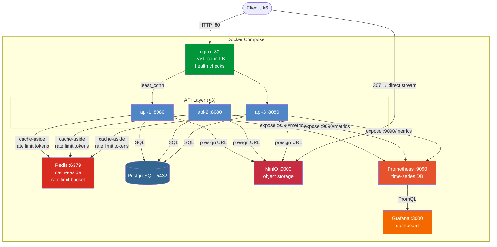
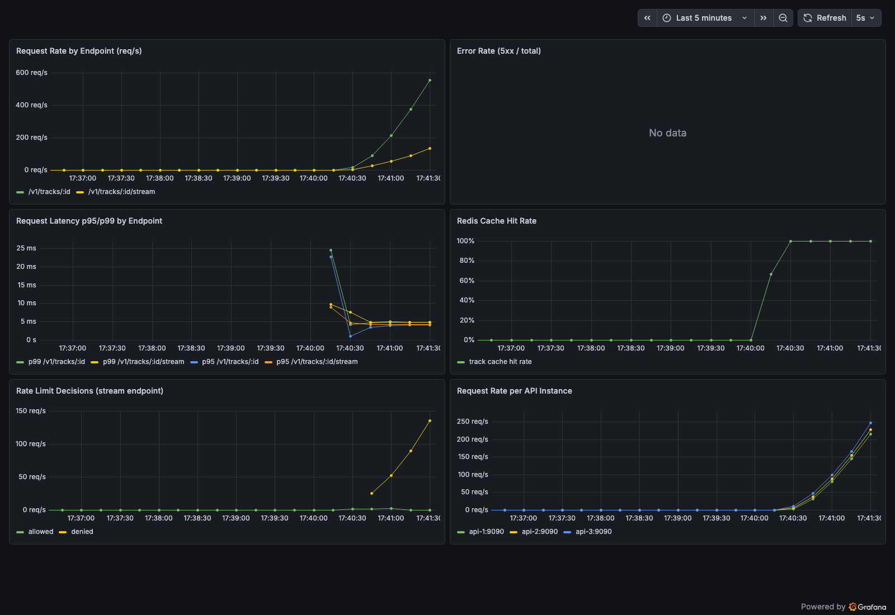

# Phase 1 — Load Balancing & Caching

## Architecture



## What we built

Put the system under real load with k6 (up to 500 VUs), added Redis caching, a token bucket rate limiter, Prometheus metrics, and a Grafana dashboard. nginx load balances across 3 API instances.

**Load test result:** 325,009 requests in 3m30s, p95 latency 11ms, cache hit rate ~99.997%.

---

## API Endpoints

### GET vs POST

- `GET` — read data, idempotent, can be cached, safe to retry
- `POST` — create something new or trigger an action, never cached
- `DELETE` — remove a resource

### All routes

| Method | Path | What it does |
|--------|------|-------------|
| POST | /v1/artists | Create an artist |
| GET | /v1/artists/:id | Get artist info |
| POST | /v1/tracks | Upload a track (mp3 + metadata) |
| GET | /v1/tracks/:id | Get track metadata ← Redis cached (1h TTL) |
| GET | /v1/tracks/:id/stream | Get a streaming URL ← rate limited |
| GET | /v1/playlists/:id | Get playlist |
| POST | /v1/playlists | Create playlist |
| GET | /v1/playlists/:id/tracks | List tracks in playlist |
| POST | /v1/playlists/:id/tracks | Add track to playlist |
| DELETE | /v1/playlists/:id/tracks/:track_id | Remove track from playlist |
| GET | /v1/search?q=... | Full-text search ← Redis cached (1min TTL) |

### /stream flow (most important)

```
1. Client: GET /v1/tracks/abc-123/stream
2. nginx routes to one of api-1/2/3
3. API queries Postgres: SELECT audio_key FROM tracks WHERE id='abc-123'
4. API calls MinIO to generate a pre-signed URL (valid 1 hour)
5. API returns HTTP 307 redirect to that URL
6. Client's browser/player follows the redirect and fetches audio directly from MinIO
   → API never touches the audio bytes
```

**Why pre-signed URL instead of proxying?**
If the API proxied audio: 1000 concurrent listeners × 5MB = 5GB/s through the API server.
Pre-signed URL: API does one lightweight DB lookup, then steps aside. MinIO handles all streaming traffic.

---

## k6 Load Testing

k6 simulates many Virtual Users (VUs) hitting your API concurrently.

### What our script does

```javascript
stages: [
  { duration: '30s', target: 50  },   // ramp up
  { duration: '2m',  target: 200 },   // sustained load
  { duration: '30s', target: 500 },   // stress test
  { duration: '30s', target: 0   },   // ramp down
]

// Each VU per iteration:
// 80% → GET /v1/tracks/:id   (metadata, cached)
// 20% → GET /v1/tracks/:id/stream  (triggers rate limiter)
// then sleep 0.1s
```

### Thresholds (pass/fail criteria)

```
http_req_duration p(99) < 200ms   — 99% of requests under 200ms
error_rate        < 1%            — less than 1% errors
stream_latency p(95) < 500ms      — stream redirect under 500ms
```

### Run it

```bash
k6 run -e TRACK_ID=aaaaaaaa-aaaa-aaaa-aaaa-aaaaaaaaaaaa k6/load.js
```

---

## p95 / p99 — What Percentiles Mean

If you measure 100 requests:

```
p50 = 10ms  → 50% of requests finished in under 10ms
p95 = 80ms  → 95% of requests finished in under 80ms
p99 = 200ms → 99% of requests finished in under 200ms
             (the worst 1% took up to 200ms)
```

**Why not average?**
99 requests at 5ms + 1 request at 5000ms = avg 55ms.
The average hides that one person waited 5 seconds.
p99 tells you the worst realistic experience.

**How to set thresholds:**
Observe normal behavior first, then set the threshold at 2-3x normal.
Our p95 was 11ms after cache warmed up, so 200ms threshold gives plenty of headroom.

| Endpoint type | Typical p99 target |
|---|---|
| Cached metadata | < 100ms |
| Search | < 200ms |
| Stream redirect | < 500ms |
| Async upload (202) | < 1s |

---

## Redis Cache

### What's inside Redis

```bash
# List all keys
docker compose exec redis redis-cli KEYS "*"

# Get a cached track (string type)
docker compose exec redis redis-cli GET "track:aaaaaaaa-aaaa-aaaa-aaaa-aaaaaaaaaaaa"
# → {"id":"...","title":"Creep","duration_ms":238000,...}

# Check TTL (seconds remaining)
docker compose exec redis redis-cli TTL "track:aaaaaaaa-aaaa-aaaa-aaaa-aaaaaaaaaaaa"
# → 3594  (about 1 hour left)

# Check data type
docker compose exec redis redis-cli TYPE "track:aaaaaaaa-..."   # → string
docker compose exec redis redis-cli TYPE "ratelimit:stream:ip"  # → hash
```

### Redis data types used

| Key pattern | Type | Why |
|---|---|---|
| `track:{uuid}` | String | Store/retrieve entire JSON at once |
| `search:{query}` | String | Store/retrieve entire JSON at once |
| `ratelimit:stream:{ip}` | Hash | Two fields (tokens + last_refill) updated separately |

### Cache-aside pattern (lazy loading)

```
Request comes in
  → Check Redis
      hit  → return cached JSON (2ms)
      miss → query Postgres (15ms) → store in Redis → return
```

**Why cache-aside, not write-through?**
Write-through updates cache on every write. Cache-aside only populates on reads.
Track metadata rarely changes, so a cold start (first read misses) is fine.
You don't pay the write cost on uploads.

**TTL choices:**
- Track metadata: 1h — rarely changes, stale for 1h is acceptable
- Search results: 1min — reflects new tracks and play counts, freshness matters more

### Confirming cache works

```bash
# Layer 1: Redis directly
redis-cli EXISTS "track:uuid"   # 1 = key exists = next request will HIT

# Layer 2: Prometheus counters
curl "http://localhost:9090/api/v1/query?query=beatstream_cache_hits_total"
curl "http://localhost:9090/api/v1/query?query=beatstream_cache_misses_total"

# Layer 3: Latency
# cache miss  → ~15ms response
# cache hit   → ~2ms response
```

### Redis resource usage

```bash
docker stats beatstream-redis-1 --no-stream
# CPU: ~0.7%,  Memory: ~11MB  (extremely lightweight)
```

---

## Token Bucket Rate Limiter

### Why the bucket lives in Redis (not API memory)

```
❌ In-memory per instance:
  api-1: 100 tokens
  api-2: 100 tokens    → same IP can make 300 requests/hour
  api-3: 100 tokens

✅ Shared in Redis:
  All three instances read/write the same bucket
  → truly 100 requests/hour regardless of which instance handles the request
```

### How token bucket works

```
Capacity:    100 tokens
Refill rate: 100 / 3600 = 0.028 tokens/second (continuous)

t=0s    request → consume 1 token → 99 remaining → HTTP 307
t=0.1s  request → consume 1 token → 98 remaining → HTTP 307
...
t=~3600s  bucket exhausted → HTTP 429 (Too Many Requests)
t=~3636s  1 token refilled → next request gets HTTP 307 again
```

**No queue — drop immediately:**
When tokens = 0, the request is rejected instantly with 429.
There is no waiting, no queue. This is by design:
- A queued request would just time out on the client side anyway
- Holding thousands of waiting connections wastes server memory
- Rate limiting is about shedding load, not delaying it

### Observing the bucket

```bash
# See bucket state in Redis
docker compose exec redis redis-cli HGETALL "ratelimit:stream:192.168.65.1"
# tokens:      97.00...   ← tokens remaining
# last_refill: 1779...    ← Unix timestamp of last refill calculation
```

### Why a Lua script

The rate limiter does: read tokens → calculate refill → subtract 1 → write back.
That's a read-modify-write — a race condition if two API instances do it at the same time.
A Redis Lua script executes **atomically** on the Redis server — no race conditions regardless of how many API instances exist.

### Fail-open design

If Redis goes down: the middleware lets all requests through.
Availability > rate limiting strictness.
A 429-storm when Redis recovers is better than blocking all traffic while Redis is down.

---

## Prometheus & Metrics

### How it works (pull model)

```
API exposes:  GET :9090/metrics  (plain text, updated in real time)
Prometheus:   scrapes that endpoint every 15 seconds → stores in its time-series DB
Grafana:      queries Prometheus → draws graphs
```

Prometheus pulls data. The API does not push.

### What /metrics looks like

```
# HELP beatstream_cache_hits_total Redis cache hits by cache name
# TYPE beatstream_cache_hits_total counter
beatstream_cache_hits_total{cache="track"} 99315
beatstream_cache_hits_total{cache="search"} 42
```

`99315` = total hits since the API started (counters only go up).
Grafana uses `rate(metric[1m])` to calculate "hits per second" — the rate of change is what makes graphs useful.

### Metrics defined in this project

| Metric | Type | Measures |
|--------|------|---------|
| `beatstream_http_requests_total` | Counter | request count by method/path/status |
| `beatstream_http_request_duration_seconds` | Histogram | latency distribution (p95, p99) |
| `beatstream_cache_hits_total` | Counter | Redis hits by cache name |
| `beatstream_cache_misses_total` | Counter | Redis misses by cache name |
| `beatstream_rate_limit_decisions_total` | Counter | allowed / denied / allowed_auth |

**Who defines metrics:** the API developer writes them in `internal/metrics/metrics.go` and calls `.Inc()` / `.Observe()` in the right places. Prometheus just collects whatever the `/metrics` endpoint exposes.

### Is Prometheus a database?

Yes — a **time-series database**. It stores `(timestamp, value)` pairs efficiently.
It's not a relational DB — you can't do JOIN or complex queries.
The query language (PromQL) is designed specifically for time-series aggregation.

### Resource usage

```bash
docker stats beatstream-prometheus-1 --no-stream
# CPU: ~0%,  Memory: ~57MB
```

---

## Load Balancing — nginx least_conn

### Round-robin vs least_conn

**Round-robin** (cycles through instances regardless of load):
```
request 1 → api-1
request 2 → api-2  
request 3 → api-3
request 4 → api-1  ← even if api-1 is still busy with a 5s upload
```

**least_conn** (always picks the instance with fewest active connections):
```
request 1 → api-1  (api-1: 1 connection)
request 2 → api-2  (api-2: 1 connection)
request 3 → api-3  (api-3: 1 connection)
request 4 → ?
  api-1 still processing upload (1 active)
  api-2 finished (0 active)  ← pick this one
request 4 → api-2
```

**Why it matters for Beatstream:** requests have very different durations.
Metadata lookup: ~2ms. Stream redirect with DB lookup: ~15ms.
least_conn prevents slow requests from overloading one instance.

### nginx config

```nginx
upstream beatstream_api {
    least_conn;
    server api-1:8080 max_fails=3 fail_timeout=30s;
    server api-2:8080 max_fails=3 fail_timeout=30s;
    server api-3:8080 max_fails=3 fail_timeout=30s;
    keepalive 32;
}
```

`max_fails=3 fail_timeout=30s`: if an instance fails 3 requests in 30 seconds, nginx stops sending traffic to it automatically.

### Observing nginx connections

```bash
# Real-time connection stats (we added this endpoint)
curl http://localhost/nginx_status

# Output:
# Active connections: 47
# server accepts handled requests
#  1024 1024 8302
# Reading: 2 Writing: 44 Waiting: 1

# Reading:  currently reading request headers
# Writing:  currently writing responses (= active in-flight requests)
# Waiting:  keep-alive connections idle, waiting for next request
```

### Verifying even distribution

```bash
# Requests per instance via Prometheus
curl "http://localhost:9090/api/v1/query?query=beatstream_http_requests_total{path='/v1/tracks/:id'}"
# api-1: 99315, api-2: 99074, api-3: 99023  → evenly distributed
```

---

## MinIO — Concurrent Streaming

### Why MinIO handles thousands of concurrent requests

**Analogy:** A library with one copy of a popular book and a photocopier.
- The book (file) sits in one place, it doesn't move.
- Each reader has their own bookmark (file descriptor + offset).
- The librarian copies the next few pages and hands them over.
- 1000 readers don't need 1000 copies of the book — just 1000 bookmarks.

**OS mechanism:**
```
file on disk → loaded into RAM (page cache) — one copy, shared

fd_A: offset = 0       ─┐
fd_B: offset = 0       ─┤ → same page cache → each gets their own copy of bytes
fd_C: offset = 512000  ─┘

Reading is non-destructive — no locks needed for concurrent reads.
```

**Go goroutines:**
- Each HTTP connection → one goroutine (~4KB)
- 1000 connections → 1000 goroutines
- Goroutines are NOT OS threads. The Go runtime multiplexes many goroutines onto a few OS threads.
- When goroutine A waits for network ACK, the runtime runs goroutine B. No thread is wasted waiting.

### Why memory doesn't multiply

Goroutines don't copy the entire file — they stream it in small chunks:

```
goroutine A:
  while not done:
    copy 64KB from page cache → send to user A's socket → free that 64KB
    wait for ACK → (Go runtime runs other goroutines here)
    copy next 64KB → ...
```

At any moment, each goroutine only holds ~64KB (one chunk buffer), not the full file.

```
page cache:            5MB   (one copy, shared by everyone)
1000 goroutine buffers: 64MB  (1000 × 64KB, cycling through)
1000 goroutine stacks:   8MB  (1000 × 8KB)
──────────────────────────────
total:  ~77MB    (not 1000 × 5MB = 5GB)
```

### Real limits (in order of what hits first)

| Limit | Typical value |
|-------|--------------|
| Network bandwidth | 1Gbps = 125MB/s → ~25 simultaneous 5MB streams |
| RAM (page cache) | depends on server RAM |
| OS file descriptors | 65536 per process (configurable) |
| Goroutine count | effectively unlimited (RAM is the real limit at ~4KB each) |

### Pre-signed URLs — different per request, same file

Every request to `/stream` generates a new unique URL:
```
user A URL: ...?X-Amz-Date=20260524T083241Z&X-Amz-Signature=686c89eb...
user B URL: ...?X-Amz-Date=20260524T083242Z&X-Amz-Signature=34f3fc78...

Same file path. Different timestamp → different signature.
```

The signature is `HMAC-SHA256(secret_key, timestamp + path + expiry)`.
URL expires after 1 hour. MinIO verifies the signature on every request — no callback to the API needed.

**Why not cache the URL and share it?**
- If the URL leaks, anyone can use it for 1 hour — no way to revoke it
- You lose per-user tracking
- After 1 hour, cached URL is invalid anyway

---

## Grafana Dashboard

Open: http://localhost:3000 (admin / admin) → Dashboards → Beatstream — Phase 1



### What the screenshot shows

The dashboard was captured during a k6 ramp-up from 0 → 200 VUs. Reading each panel:

| Panel | What you're seeing |
|-------|-------------------|
| **Request Rate by Endpoint** | `/tracks/:id` (green) climbs to ~600 req/s; `/stream` (yellow) ~150 req/s — 80/20 split from the k6 script |
| **Error Rate (5xx / total)** | "No data" = zero server errors throughout the test ✓ |
| **Request Latency p95/p99** | Cold-start spike to ~25ms, then drops to ~5ms after Redis cache warms — visible "cliff" on the graph |
| **Redis Cache Hit Rate** | 0% on cold start → ~100% within seconds; the sharp rise is the cache warming on first request per key |
| **Rate Limit Decisions** | `allowed` (green) rising with traffic; `denied` (yellow) appearing as VUs exhaust 100-token buckets |
| **Request Rate per API Instance** | api-1/2/3 three lines tracking together — least_conn distributes load evenly |

### Grafana vs Postman

| Tool | Use for |
|------|---------|
| Postman | "Does this endpoint return the right data?" (functional testing) |
| Grafana | "How is the system behaving under load?" (observability) |

Both are needed. Grafana can't tell you if the response body is correct. Postman can't tell you what p99 latency looks like under 500 VUs.

### Grafana vs Postman

| Tool | Use for |
|------|---------|
| Postman | "Does this endpoint return the right data?" (functional testing) |
| Grafana | "How is the system behaving under load?" (observability) |

Both are needed. Grafana can't tell you if the response body is correct. Postman can't tell you what p99 latency looks like under 500 VUs.

---

## Gotchas Discovered

| Problem | Root cause | Fix |
|---------|-----------|-----|
| Grafana "No data" on all panels | Datasource UID mismatch — Grafana auto-generates a UID, dashboard JSON hardcodes one | Add `uid: prometheus` to the datasource provisioning YAML |
| Cache hit rate panel shows "No data" after test ends | `rate(...[1m])` = 0 after traffic stops; 0/0 = NaN | Use `increase(...[5m])` with `clamp_min(..., 1)` as denominator |
| k6 error rate 20% with rate limiter | k6 counts 429 as errors; 500 VUs sharing one IP exhaust 100 tokens almost immediately | Expected behavior — in production each user has their own IP |

---

## Experiment Results

```bash
# Kill one API instance mid-test
docker compose stop api-2
k6 run ...
# Result: near-zero additional errors — nginx detects failure via max_fails and stops routing to api-2

# Kill Redis
docker compose stop redis
curl http://localhost/v1/tracks/:id
# Result: still returns 200 — falls back to DB (fail-open)
# Rate limiter also fails open — all stream requests allowed
```

---

## Quick Reference — Useful Commands

```bash
# See what's in Redis
docker compose exec redis redis-cli KEYS "*"
docker compose exec redis redis-cli GET "track:{uuid}"
docker compose exec redis redis-cli HGETALL "ratelimit:stream:{ip}"
docker compose exec redis redis-cli TTL "track:{uuid}"

# Watch nginx connections
curl http://localhost/nginx_status

# Query Prometheus directly
curl "http://localhost:9090/api/v1/query?query=beatstream_cache_hits_total"
curl "http://localhost:9090/api/v1/query?query=rate(beatstream_http_requests_total[1m])"

# Resource usage
docker stats --no-stream

# Run load test
k6 run -e TRACK_ID=aaaaaaaa-aaaa-aaaa-aaaa-aaaaaaaaaaaa k6/load.js
```

---

## Interview Talking Points

**"Your /stream endpoint is getting hammered. Walk me through your caching strategy."**
> I use cache-aside on the track metadata endpoint. First request hits Postgres and populates Redis with a 1-hour TTL. Subsequent requests are served from Redis in ~2ms vs ~15ms from DB. At 325k requests in our load test, we had 3 cache misses total — one per API instance on cold start.

**"How did you implement rate limiting and what algorithm did you use?"**
> Token bucket. Each unauthenticated IP gets 100 tokens per hour, refilling continuously at 100/3600 per second. The key insight is that the read-modify-write must be atomic — I use a Redis Lua script so all three API instances share a single consistent bucket per IP without race conditions. If Redis goes down, I fail open rather than blocking all traffic.

**"Why least_conn instead of round-robin?"**
> Round-robin assumes all requests take the same time. With audio streaming, some requests are fast (metadata, 2ms) and some slower (stream redirect with DB query, 15ms). least_conn routes to whichever instance has the fewest in-flight connections, preventing slow requests from piling up on one instance.

**"Why use pre-signed URLs for audio streaming?"**
> If we proxied audio through the API, 1000 concurrent listeners × 5MB per song = 5GB/s through our servers. Pre-signed URLs let clients fetch audio directly from object storage. The API just does a lightweight DB lookup and generates a signed URL — it never touches the audio bytes. Object storage handles the concurrent reads cheaply because reading is non-destructive: thousands of clients can read the same file simultaneously without locks.
