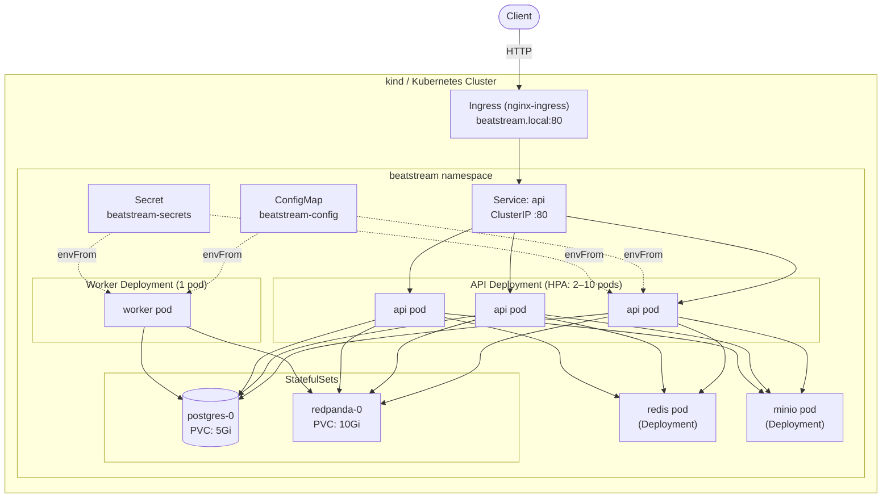

# Phase 3 — Kubernetes

## Architecture



## Goal

Replace Docker Compose with Kubernetes to gain:
1. **Automatic horizontal scaling** (HPA) — react to CPU spikes without manual intervention.
2. **Self-healing** — pods that crash or fail health checks are automatically restarted or replaced.
3. **Rolling zero-downtime deploys** — update the API without dropping requests.
4. **Declarative config separation** — credentials go into Secrets, not baked into YAML.

---

## Files added

```
beatstream/k8s/
├── namespace.yaml             # beatstream namespace
├── configmap.yaml             # non-sensitive env config
├── secret.yaml                # credentials (DB, MinIO, Redis)
├── api-deployment.yaml        # Deployment: 3 replicas, rolling update, probes, preStop
├── api-service.yaml           # ClusterIP Service → HPA target
├── api-hpa.yaml               # HPA: 2–10 pods, CPU 60%, memory 70%
├── worker-deployment.yaml     # Deployment: 1 replica, Recreate strategy
├── postgres-statefulset.yaml  # StatefulSet + volumeClaimTemplate 5Gi
├── postgres-service.yaml      # Headless service (stable pod DNS)
├── redis-deployment.yaml      # Deployment + ClusterIP service
├── redpanda-statefulset.yaml  # StatefulSet + volumeClaimTemplate 10Gi + headless service
├── minio-deployment.yaml      # Deployment + ClusterIP service
└── ingress.yaml               # Ingress (nginx): routes /v1/, /healthz, /ready
```

---

## K8s Architecture — 大腦和手腳

K8s 分兩層：Control Plane（大腦）和 Worker Nodes（手腳）。

```
┌─────────────────────────────────────────────────────────────┐
│                      Control Plane                          │
│                                                             │
│  ┌─────────────┐    ┌──────────┐    ┌───────────────────┐  │
│  │  API Server │    │  etcd    │    │ Controller Manager │  │
│  │  (唯一入口)  │◄──►│ (狀態DB) │    │  (幾十個 loop)    │  │
│  └──────┬──────┘    └──────────┘    └───────────────────┘  │
│         │                                                   │
│  ┌──────┴──────┐                                            │
│  │  Scheduler  │                                            │
│  │ (決定去哪台) │                                            │
│  └─────────────┘                                            │
└──────────────────────────┬──────────────────────────────────┘
                           │ (watches API Server)
          ┌────────────────┼────────────────┐
   ┌──────▼──────┐  ┌──────▼──────┐  ┌──────▼──────┐
   │  Worker 1   │  │  Worker 2   │  │  Worker 3   │
   │  kubelet    │  │  kubelet    │  │  kubelet    │
   │  kube-proxy │  │  kube-proxy │  │  kube-proxy │
   │  containerd │  │  containerd │  │  containerd │
   └─────────────┘  └─────────────┘  └─────────────┘
```

### etcd — 唯一的真相來源

整個 K8s 的狀態都在 etcd 裡。你 apply 的所有 YAML、pod 在哪個 node、service 的 endpoint、secret 的內容，全部存在這個 key-value store。

```
/registry/pods/beatstream/api-xxx        →  {spec, status, ...}
/registry/deployments/beatstream/api     →  {replicas: 3, ...}
/registry/endpoints/beatstream/api       →  {10.244.0.23, 10.244.0.24, ...}
```

**etcd 掛了 = 沒人知道「現在的狀態是什麼」。** 現有 pod 還會繼續跑（worker node 不依賴 etcd），但你無法新建、修改、刪除任何東西。

### API Server — 唯一的入口

所有人（kubectl、kubelet、controller）都只能透過 API Server 跟 etcd 說話。它負責認證、授權（RBAC）、格式驗證，再把結果寫進 etcd。

最重要的功能：**watch 機制**。任何元件都可以說「幫我盯著這個資源，有變動立刻通知我」。整個 K8s 的反應速度靠這個，沒有輪詢。

### Scheduler — 只做一件事

發現有 Pod 沒有 `nodeName` 時，選一個 node 填進去。邏輯分兩步：
1. **Filter**：哪些 node 能跑？（資源夠嗎？有 taint？符合 affinity？）
2. **Score**：剩下的哪個最好？（資源最多、同類 pod 最少）

Scheduler 只寫 `nodeName`，不啟動任何 container。

### Controller Manager — 幾十個 reconciliation loop

每個 controller 只負責一件事，邏輯模式都一樣：

```go
func reconcile() {
    desired := 讀你宣告的狀態
    actual  := 觀察現在的狀態
    if desired != actual {
        建立 / 刪除 / 更新 K8s 物件   // 不是直接跑 container，是操作物件
    }
}
```

**複雜度靠組合，不靠單一 controller 變複雜：**

```
你說：Deployment replicas=3
  → Deployment Controller 建 ReplicaSet 物件
  → ReplicaSet Controller 建 3 個 Pod 物件（只是 etcd 的資料）
  → Scheduler 填 nodeName 欄位
  → kubelet 叫 containerd 實際跑 container
  → kubelet 打 readinessProbe → 寫 pod.status.ready = true
  → Endpoint Controller 把 pod IP 加進 Service 的 endpoint 清單
  → kube-proxy 更新 iptables
```

每層都很簡單，組合起來完成複雜的事。這是 K8s 架構最漂亮的地方（Separation of Concerns）。

### kubelet — node 上的管家

kubelet 不是 K8s 裡面的 pod，是 node 上的 system daemon，比 K8s 本身更底層。

```
1. watch API Server：「有 nodeName=我、但還沒跑的 pod？」
2. 叫 containerd（透過 CRI 介面）pull image、建 container、掛 volume
3. 定期打 liveness / readiness probe
   - liveness 失敗 → kill + restart container
   - readiness 失敗 → pod status 改 not ready → Endpoint Controller 把它移出 Service
4. 把 pod 狀態回寫 API Server
```

kubelet 是「API Server 世界」和「真實 container 世界」的唯一橋樑。

### kube-proxy — 維護幻象 IP 的人

名字叫 proxy，但它**不代理流量**，只是維護 iptables 規則。

```
你 curl http://10.96.140.94:80   ← ClusterIP，這台機器根本不存在

封包到達 10.96.140.94
→ kernel netfilter 攔截
→ 查 iptables（由 kube-proxy 維護）
→ DNAT 到真實 pod IP（10.244.0.23:8080）
→ 封包到達 pod
```

kube-proxy watch Endpoint 變化，同步更新每個 node 上的 iptables。pod 加入或移除時，規則即時更新，這就是 Service 「load balancing」的真相。

---

## etcd Quorum — 為什麼要 3 或 5 個節點

etcd 用 **Raft 共識演算法**，核心規則：

> **任何寫入，必須超過半數節點確認，才算成功。**

| 節點數 | 需確認數 | 可承受故障 | 備註 |
|---|---|---|---|
| 1 | 1 | 0 | 單點故障 |
| 2 | 2 | 0 | 跟 1 個一樣爛，但貴一倍 |
| **3** | **2** | **1** | 最低 HA 配置 |
| **5** | **3** | **2** | 生產推薦 |

**為什麼一定是奇數？** 偶數節點會遇到 split-brain：

```
4 個節點，網路斷開分兩組：
  A 組（2 個）：「我們有 quorum！」
  B 組（2 個）：「不，我們才有！」
  → 兩組都湊不到 3/4，全部卡死

3 個節點，網路斷開分兩組：
  A 組（2 個）：「我們有 2/3 quorum，繼續服務」  ✓
  B 組（1 個）：「我只有 1/3，我等待」
  → 只有一組能繼續，不會腦裂
```

寫入流程：

```
你 kubectl apply → API Server → etcd leader
                                  ↓ 複製給 follower-1（確認）
                                  ↓ 複製給 follower-2（確認）
                               2/3 確認 → 寫入成功 → 回傳 API Server
```

---

## Docker Compose → Kubernetes 概念對照

| Docker Compose | Kubernetes | 關鍵差異 |
|---|---|---|
| `image` + 手動 scale | `Deployment` + HPA | K8s 持續 reconcile，自動修正 |
| `healthcheck`（一個） | `livenessProbe` + `readinessProbe` | 語意不同：一個重啟，一個拔流量 |
| Container 名稱 DNS | `Service` 名稱 DNS | 必須建 Service 才有 DNS + LB |
| Named volumes | `PersistentVolumeClaim` | PVC 生命週期獨立於 pod |
| `restart: unless-stopped` | Controller reconciliation loop | K8s 不只重啟，還管排程、資源、健康 |
| `environment:` 寫死 | `ConfigMap` + `Secret` | Secret 有獨立 RBAC 和稽核 |
| nginx upstream | `Service` (kube-proxy/iptables) | 平台內建，不需要額外 proxy |
| 沒有 | `HorizontalPodAutoscaler` | 根據 CPU/memory 自動調整 replica 數 |
| `docker compose up` | `kubectl apply -f k8s/` | 宣告式：K8s 算 diff，你不用管順序 |

---

## livenessProbe vs readinessProbe

這是 K8s 面試最常考的概念之一。

```
/healthz  →  livenessProbe   →  失敗 → kubelet kill + restart pod
/ready    →  readinessProbe  →  失敗 → 從 Service endpoint 移除（不重啟）
```

**鐵則：liveness 絕對不能 check 外部依賴（DB、Redis）。**

如果 DB 掛掉：
- liveness check DB 失敗 → 所有 pod 同時重啟 → 造成 thundering herd → DB 更難恢復
- readiness check DB 失敗 → pod 暫時下線，不重啟，等 DB 恢復後自動重新加入 ✓

```
Pod 生命週期：
  啟動 → readiness 失敗（不在 Service）→ DB 連線成功 → readiness 過 → 開始收流量
                                        ↕
                     liveness 失敗 → kubelet restart（只在 deadlock 等情況）
```

---

## Zero-downtime Rolling Update

三個機制缺一不可：

```
Rolling Update 一個 pod 的完整流程：

1. 建立新 pod（暫時有 4 個）
2. 新 pod 的 readinessProbe 開始打 /ready
3. /ready 通過 → 加進 Service endpoint → 開始收流量
4. K8s 對舊 pod 送 SIGTERM
5. preStop hook：sleep 5s（等 iptables 規則在所有 node 更新完）
6. Go server 收到 SIGTERM → 關 listener → 等 in-flight request 跑完 → 退出
7. 舊 pod 真正死亡，縮回 3 個
```

**preStop 的必要性（常被忽略的坑）：**

```
K8s 把 pod 從 endpoint 移除
  ↓
kube-proxy 還沒更新所有 node 的 iptables（需要幾秒傳播）
  ↓ 沒有 preStop 的話
舊 pod 同時收到 SIGTERM 開始關閉
  ↓
這幾秒內仍有 request 打到這個 pod → 502
```

```yaml
# api-deployment.yaml 的三個保護機制
strategy:
  rollingUpdate:
    maxUnavailable: 0   # 舊 pod 不先砍，容量不縮水
    maxSurge: 1         # 最多多一個新 pod

lifecycle:
  preStop:
    exec:
      command: ["sleep", "5"]   # 等 iptables 傳播

# readinessProbe 確保新 pod ready 才收流量
# terminationGracePeriodSeconds: 30 確保 in-flight request 跑完
```

**壞版本部署的自然防護：**
新 pod image 不存在或 crash → 永遠過不了 readiness → 永遠不加進 endpoint → 舊 pod 不會被砍 → 部署自動卡住，不影響線上服務。用 `kubectl rollout undo` 回滾。

---

## HPA — 自動水平擴縮

```
HPA controller（每 15 秒跑一次）：
  desired_replicas = ceil(current_replicas × current_avg_cpu / target_cpu)

例：3 pods，各 request 100m CPU，實際用 90m → 90% utilization，target 60%
desired = ceil(3 × 90/60) = ceil(4.5) = 5 pods → 自動加到 5
```

**必要條件**：pod 一定要設 `resources.requests.cpu`。HPA 用 usage/request 算百分比，沒有 request 就無法計算，HPA 會一直顯示 `<unknown>`。

Scale-down 有 300s stabilization window 防止抖動；scale-up 立即反應。

---

## StatefulSet vs Deployment

| | Deployment | StatefulSet |
|---|---|---|
| Pod 名稱 | 隨機（`api-7d6f5-abc`） | 穩定有序（`postgres-0`, `postgres-1`） |
| DNS | 只透過 Service | `pod-N.service.namespace.svc.cluster.local` |
| Scaling | 並行 | 有序（0→1→2 up，2→1→0 down） |
| Storage | 共用 PVC 或 emptyDir | 每個 pod 一個獨立 PVC（volumeClaimTemplates） |
| 適合 | 無狀態 app | 資料庫、Kafka broker |

Postgres 和 Redpanda 用 StatefulSet 的原因：
- 需要穩定網路身份（Redpanda broker 要公告自己的地址）
- 重新排程到其他 node 時，必須接回同一份資料

---

## Redpanda v26 踩坑

**坑 1：`command:` vs `args:` 語意不同**

| | Docker Compose | Kubernetes |
|---|---|---|
| `command:` | 覆蓋 CMD，保留 ENTRYPOINT | 覆蓋 ENTRYPOINT（繞過 /entrypoint.sh） |
| `args:` | — | 覆蓋 CMD，保留 ENTRYPOINT |

Redpanda image 的 ENTRYPOINT 是 `/entrypoint.sh`，它把 `redpanda start <args>` 轉換成 `rpk redpanda start <args>`。K8s 用 `command:` 會繞過它，導致旗標解析失敗。**解法：K8s 用 `args:`。**

**坑 2：`--check=false` 在 v26 移除**

改用 `--mode dev-container`，它內建：
- `--overprovisioned`
- `--reserve-memory 0M`
- `--check=false`
- auto topic creation

---

## Worker scaling 與 partition 對應

```
topic: track.uploads（1 個 partition）
consumer group: upload-workers

replicas=1 → consumer-0 擁有 partition-0  ✓
replicas=2 → consumer-0 擁有 partition-0，consumer-1 閒置  ✗
```

**規則**：最多有效 worker replicas = topic 的 partition 數。要橫向擴展 worker，先增加 partition：

```bash
rpk topic alter-config track.uploads --set num.partitions=3
# 然後把 worker Deployment 的 replicas 改成 3
```

Worker 用 `strategy: Recreate`（不用 RollingUpdate），因為單 partition 時若同時有新舊兩個 consumer，會觸發 rebalance，造成短暫停止消費。

---

## ConfigMap vs Secret

| | ConfigMap | Secret |
|---|---|---|
| 存什麼 | 非敏感設定 | 密碼、token、TLS cert |
| 編碼 | 明文 | base64（不是加密！） |
| 生產建議 | 正常使用 | Vault / Sealed Secrets / ESO |

`stringData` 讓你寫明文，K8s apply 時自動 base64 encode。生產環境絕對不能把 Secret 的明文 commit 進 Git。

---

## 從 kubectl apply 到 pod 跑起來的完整流程

```
kubectl apply -f api-deployment.yaml
    ↓
1. API Server：驗證 YAML → 寫進 etcd

2. Deployment Controller 的 watch 觸發
   → 建 3 個 Pod 物件（etcd 裡的資料，nodeName 空白）

3. Scheduler 的 watch 觸發
   → Filter + Score 選 node
   → 寫 nodeName = "worker-1"

4. worker-1 的 kubelet 的 watch 觸發
   → containerd pull image
   → 啟動 container
   → 打 readinessProbe
   → /ready 通過 → 寫 pod.status.ready = true

5. Endpoint Controller 的 watch 觸發
   → 把新 pod IP 加進 Endpoints 物件

6. kube-proxy 的 watch 觸發
   → 更新這個 node 的 iptables DNAT 規則

7. 第一個 request 打進來，流量正確到達 pod ✓
```

整個過程 5~10 秒，全靠 watch 事件驅動，沒有任何元件在輪詢。

---

## Phase 規劃

| Phase | 重點 | 關鍵概念 |
|---|---|---|
| Phase 0 | 本地 monolith | REST API、PostgreSQL、MinIO |
| Phase 1 | Load balancing + caching | nginx、Redis cache-aside、rate limiting |
| Phase 2 | Async queues | Redpanda/Kafka、at-least-once、worker |
| **Phase 3** | **Kubernetes** | **Deployment、StatefulSet、HPA、probe、rolling update** |
| Phase 4 | Cloud（EKS/GKE） | Managed K8s、LoadBalancer、Blue-Green deploy |
| Phase 5 | Observability | Prometheus、Grafana、distributed tracing |
| Phase 6 | Canary deploy | 流量切分、自動 rollback（需要 Phase 5 的 metrics） |

---

## Local dev 指令

```bash
# 環境準備（只需第一次）
brew install kind
kind create cluster --name beatstream

# 每次部署
docker build -t beatstream-api:latest --target api .
docker build -t beatstream-worker:latest --target worker .
kind load docker-image beatstream-api:latest --name beatstream
kind load docker-image beatstream-worker:latest --name beatstream
kubectl apply -f k8s/namespace.yaml  # 先建 namespace
kubectl apply -f k8s/

# 觀察
kubectl -n beatstream get pods,hpa -w
kubectl -n beatstream rollout status deployment/api

# 測試
kubectl -n beatstream port-forward svc/api 8080:80
curl http://localhost:8080/healthz

# Rolling update
kubectl -n beatstream set image deployment/api api=beatstream-api:v2
kubectl -n beatstream rollout status deployment/api
kubectl -n beatstream rollout undo deployment/api  # rollback

# 清理
kind delete cluster --name beatstream
```

---

## Interview questions

**Q: livenessProbe 和 readinessProbe 的差異？為什麼 liveness 不能 check DB？**

Liveness 失敗會觸發 pod restart；readiness 失敗只把 pod 從 Service endpoint 移除，不重啟。如果 liveness check DB，DB 掛掉時所有 pod 同時重啟，對 DB 造成 thundering herd，反而讓 DB 更難恢復。Readiness check DB 的話，pod 只是暫時不收流量，等 DB 恢復後自動重新加入。

**Q: HPA 設定了但 pod 沒有在 scale，要 check 什麼？**

1. metrics-server 有沒有裝（`kubectl top pods` 能不能用）
2. Pod 有沒有設 `resources.requests.cpu`（沒有的話 HPA 顯示 `<unknown>`）
3. `kubectl describe hpa api -n beatstream` 看 Events，有沒有錯誤訊息
4. 實際 CPU 使用率有沒有超過 target（`kubectl top pods -n beatstream`）

**Q: 為什麼 Postgres 要用 StatefulSet 而不是 Deployment？**

Deployment 的 pod 名稱隨機，重新排程後可能拿到不同的 PVC。StatefulSet 保證 pod 名稱穩定（`postgres-0`）、網路身份穩定（固定 DNS）、且 volumeClaimTemplates 確保每個 pod 永遠連回同一個 PVC，不管被排程到哪個 node。

**Q: Rolling update 進行中發現 error rate 上升，怎麼辦？**

```bash
kubectl -n beatstream rollout undo deployment/api
# 或指定版本
kubectl -n beatstream rollout history deployment/api
kubectl -n beatstream rollout undo deployment/api --to-revision=2
```

K8s 保留 revision history（預設 10 個），rollback 是秒級的。`maxUnavailable: 0` 確保更新期間舊 pod 不會先被砍，所以有足夠時間偵測到問題再 rollback。

**Q: etcd 為什麼要奇數個節點？**

etcd 用 Raft 演算法，寫入需要超過半數（quorum）確認。奇數節點下，網路分割只會讓一邊取得 quorum，防止 split-brain（兩邊都認為自己是 leader、各自接受寫入、導致資料分叉）。2 個節點的問題是需要 2/2 確認，死一台就沒有 quorum，跟 1 台一樣爛卻貴一倍。

**Q: 一個 pod 從 kubectl apply 到能收 request，中間發生了什麼？**

① API Server 驗證寫進 etcd → ② Deployment Controller 建 Pod 物件 → ③ Scheduler 填 nodeName → ④ kubelet 叫 containerd 跑 container → ⑤ kubelet 打 readinessProbe 通過後寫 pod Ready → ⑥ Endpoint Controller 把 pod IP 加進 Endpoints → ⑦ kube-proxy 更新 iptables DNAT 規則 → ⑧ 流量到達 pod。全程靠 watch 事件驅動，約 5~10 秒。
